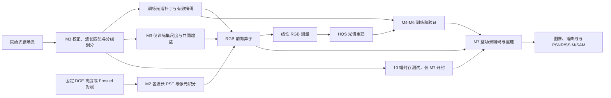

# 项目地图与 M3 之后的复现路线

更新日期：2026-10-07，北京时间。[回到日常入口](D:/PyCharmProjects/Jeon2019/START_HERE.md)。本轮整理停在 M3；目标是先完成 M7 正式仿真，再系统回看模块。

## 1. 三套阶段名称如何对应

| 名称 | 当时解决的问题 | 现在怎样使用 |
| --- | --- | --- |
| `stage01`、`stage02A–02F` | 从传播、DOE、采样与像元积分，走到三波段成像和基础重建 | 作为物理实现与早期验证的来源；不能直接当作完整论文训练结果 |
| `G0–G5` 及光学诊断支线 | G0 冻结旧成果，G1–G5 打通 25 波段、RGB、HQS、小规模真实数据训练和指标 | 作为已验证模块及诊断结果；旧权重和小样本指标不替代正式模型与测试 |
| `M0–M7` | 统一协议，建立 GPU、正式算子、多数据集、可恢复训练、公平对照和最终测试 | 当前主线；已完成 M0–M3，接下来是 M4 |

G 编号和 M 编号不是一一对应。例如 M2 同时冻结光学与 RGB 算子，M3 同时处理数据、尺度和最终共同增益。历史文档中“尚未执行”的说法要结合其记录日期阅读。

## 2. 文件按职责找

| 位置 | 职责 | 平时是否需要进入 |
| --- | --- | --- |
| [正式流程](D:/PyCharmProjects/Jeon2019/outputs/jeon2019_optics/reproduction_v1) | 当前入口、协议、M1–M3 源码、测试和 M0–M7 任务 | 是；下一步开发围绕这里展开 |
| [正式结果](D:/PyCharmProjects/Jeon2019/outputs/jeon2019_optics/results/reproduction_v1) | 各 M 阶段运行、审核、交付回执 | 优先用本页固定链接，不逐目录猜测正式版本 |
| [optics 模块](D:/PyCharmProjects/Jeon2019/outputs/jeon2019_optics/optics) | 历史物理、RGB、HQS 和指标实现；正式流程仍复用部分模块 | 以后沿模块地图阅读；冻结模块保留来源关系 |
| [旧入口与配置](D:/PyCharmProjects/Jeon2019/outputs/jeon2019_optics) | `main_stage*`、`main_g*` 与各阶段配置 | 重看旧实验或排查差异时使用 |
| [历史阶段文档](D:/PyCharmProjects/Jeon2019/outputs/jeon2019_optics/docs) | 早期完成报告、公式、参数与假设 | 查某项旧结论的出处时使用 |
| [G0 冻结](D:/PyCharmProjects/Jeon2019/baseline/g0_20261005/README.md) | 历史代码、结果来源、字节指纹与恢复约定 | 查历史保护和迁移约束时使用 |
| [数据工作区](D:/PyCharmProjects/Jeon2019/work/datasets/reproduction_v1) | 原始数据获取记录、来源桥接、预处理数据与测试 fixture | 由数据清单定位文件；部分 ICVL 原始来源在 H 盘 |
| [环境](D:/PyCharmProjects/Jeon2019/work/environments)、[依赖](D:/PyCharmProjects/Jeon2019/work/dependencies) | 独立 GPU 环境和辅助依赖 | 排查运行环境时使用；不作为研究结果目录 |

### 历史导航：临时脚本、失败运行、审核证据

根目录 `_cleanup*`、`_select_runs*`、`_stage_*`、`_build_archive.py` 等文件是历史清理、精选、归档或提交辅助工具；它们不是当前复现入口。尤其清理脚本可能删除文件，旧清单不代表本轮删除授权。

`work/m1_*`、`work/m2_*`、`work/m3_*` 日志记录执行细节。正式结果中的失败运行、诊断运行、`fixtures`、`_test_evidence` 保留故障与测试证据；判断完成状态要读对应审核和交付回执。

`outputs/执行_*`、`审核_*`、`复审_*`、`接手*` 保存历史独立审核和交接材料。M 阶段还将部分独立审核放在其正式结果目录。Git 收录的是精选源码与证据，完整本地数据及数组并不全部随仓库分发；克隆仓库不等于恢复全部实验。

历史路径与 SHA 是复现来源的一部分，本轮通过导航整合它们，不改动文件位置。

## 3. 系统里的数据怎样走



DOE 是衍射光学元件；PSF 是一个点在相机上形成的光斑。不同波长使用同一个器件高度，各自形成不同的 PSF。RGB 算子把 25 个波段经光学模糊和相机响应加权后合成为 3 个通道；HQS 网络利用测量约束与学习先验估计光谱场景。

| 模块 | 用途与输入 → 输出 | 代码入口 | 已有验证证据 |
| --- | --- | --- | --- |
| 光学编码 | 固定器件高度、波长和材料 → 25 个波长核；每种器件原生 97×97，训练映射 49×49 | [m2_optics.py](D:/PyCharmProjects/Jeon2019/outputs/jeon2019_optics/reproduction_v1/m2_optics.py)；复用历史传播和材料模块 | [M2 审核](D:/PyCharmProjects/Jeon2019/outputs/jeon2019_optics/results/reproduction_v1/m2/run_20261007_104321_03d47940/audit.json)：两器件共 50 个波段、采样及面积映射 |
| RGB 前向与伴随 | `[N,25,H,W]` 相对谱密度 → `[N,3,H,W]` RGB；伴随将 RGB 残差映回光谱空间 | [m2_operator.py](D:/PyCharmProjects/Jeon2019/outputs/jeon2019_optics/reproduction_v1/m2_operator.py) 的 `EnergyRGB` | M2 内积、直接卷积、自动微分核对；M1 CPU/GPU 执行一致性 |
| 数据处理 | Harvard/ICVL/KAIST 原始格式 → 对齐 25 波段、场景分组、训练/验证数据与有效掩码 | [m3_readers.py](D:/PyCharmProjects/Jeon2019/outputs/jeon2019_optics/reproduction_v1/m3_readers.py)、[m3_pipeline.py](D:/PyCharmProjects/Jeon2019/outputs/jeon2019_optics/reproduction_v1/m3_pipeline.py) | [M3 独立审核](D:/PyCharmProjects/Jeon2019/outputs/jeon2019_optics/results/reproduction_v1/m3/review_840f6c497c57/independent_completion_audit.json)：来源、波长、校正及分组 |
| 补丁读取与增益 | 冻结索引、训练尺度和场景文件 → `(25×256×256 补丁, 256×256 bool 掩码)`，两器件共同增益 | [m3_index.py](D:/PyCharmProjects/Jeon2019/outputs/jeon2019_optics/reproduction_v1/m3_index.py) 的 `BoundedReader`、`fit_gain` | M3 同种子索引重放、真实掩码与缓存实测；尺度已在读取时应用 |
| HQS 重建 | RGB 测量、对应前向/伴随及学习参数 → 25 波段预测 | [g3_hqs.py](D:/PyCharmProjects/Jeon2019/outputs/jeon2019_optics/optics/g3_hqs.py) 的 `HQSStage`、`HQSDecoder` | G3 与 M1 验证阶段计算、梯度和 CPU/GPU 一致性；正式训练器仍待 M4 实现 |
| 指标评价 | 预测、真值与有效范围 → PSNR、SSIM、SAM、图件及差异报告 | 历史 [g5_metrics.py](D:/PyCharmProjects/Jeon2019/outputs/jeon2019_optics/optics/g5_metrics.py)；正式整场景评价待 M7 | 旧指标审核仅作为来源；M7 还需完成独立指标核对 |

当前光谱范围为 420–660 nm、间隔 10 nm。谱带宽度权重在 RGB 算子中计一次；核保留有限相机窗口通光量，不把每波段强制归一到 1。相机响应是实测相对响应替代来源，跨库尺度及 KAIST 平坦照明代理是实施假设。更深入的公式解释放到正式结果完成后的模块回看。

## 4. 正式产物固定在哪个版本

| 阶段 | 选择正式版本的依据 | 固定入口 |
| --- | --- | --- |
| M0 | `m0_index.json` 中绑定的交接对象 SHA 与审核状态 | [索引](D:/PyCharmProjects/Jeon2019/outputs/jeon2019_optics/reproduction_v1/m0_index.json)、[正式报告](D:/PyCharmProjects/Jeon2019/outputs/jeon2019_optics/results/reproduction_v1/m0/run_20261006_230835_592a12d3/report.md) |
| M1 | 首次 GPU 验收及后续修复回执；修复后 CUDA 自检与完整独立重验 | [首次 GPU 最终审核](D:/PyCharmProjects/Jeon2019/outputs/执行_M1_GPU环境_20261007/最终审核.json)、[最新修复报告](D:/PyCharmProjects/Jeon2019/outputs/jeon2019_optics/results/reproduction_v1/m1/fix_20261007_163655/M1_fix_report.md)、[修复回执](D:/PyCharmProjects/Jeon2019/outputs/jeon2019_optics/results/reproduction_v1/m1/fix_20261007_163655/fix_receipt.json) |
| M2 | M3 正式配置指定父运行，显式来源桥接验证旧入口字节；物理核不变 | [正式报告](D:/PyCharmProjects/Jeon2019/outputs/jeon2019_optics/results/reproduction_v1/m2/run_20261007_104321_03d47940/report.md)、[父来源桥接](D:/PyCharmProjects/Jeon2019/work/datasets/reproduction_v1/parent_m2_20261007_verified/bridge.json) |
| M3 | masked_v3 正式运行、独立审核、交付回执及最终数据/算子指纹 | [交付报告](D:/PyCharmProjects/Jeon2019/outputs/jeon2019_optics/results/reproduction_v1/m3/delivery_20261007_160046/M3_delivery.md)、[回执](D:/PyCharmProjects/Jeon2019/outputs/jeon2019_optics/results/reproduction_v1/m3/delivery_20261007_160046/completion_receipt.json)、[最新联合检查记录](D:/PyCharmProjects/Jeon2019/outputs/jeon2019_optics/results/reproduction_v1/m3/run_20261007_164140_M1_entry_fixes_20261007/main_check_M1_entry_fixes_20261007.json) |

M3 交付回执中的 `M1_gpu_ready=false` 记录的是当时的 GPU 诊断；后续 M1 修复回执更新了环境状态。现有联合检查的 `milestones.M1` 仍为静态 `dependency_pending`，以实际 M1 审核及 `environment.gpu_environment_ready` 判断，不修改旧记录来掩盖状态变化。

### 数据规模与 M4 交接注意点

| 数据集 | 训练 | 验证 | 封存测试 | 合计 |
| --- | ---: | ---: | ---: | ---: |
| Harvard | 52 | 6 | 0 | 58 |
| ICVL | 135 | 15 | 0 | 150 |
| KAIST | 16 | 4 | 10 | 30 |
| 合计 | 203 | 25 | 10 | 238 |

30,000 条训练索引覆盖全部 203 幅训练场景，其中 2,912 条带部分有效掩码。后续训练必须使用读取器返回的真实 mask，按有效像元计算损失；不能把无效区域当作观测，也不能再次应用已经在读取时使用的训练尺度。历史 Harvard img3/img4/img5 及其关联组已排除正式数据划分。

M4 使用 M3 最终包，而不是 M2 的待拟合增益包。最终共同增益为 `0.003682718635788138`，两器件共用。完整指纹如下，可与 [数据版本](D:/PyCharmProjects/Jeon2019/outputs/jeon2019_optics/results/reproduction_v1/m3/run_20261007_154644_d46e6171/data_version.json)、[测试封条](D:/PyCharmProjects/Jeon2019/outputs/jeon2019_optics/results/reproduction_v1/m3/run_20261007_154644_d46e6171/test_seal.json)及两个最终算子包核对：

| 交接对象 | SHA-256 内容指纹 |
| --- | --- |
| 数据 | `4d966a84c3a19e5744f73b81277dddbdf3631d91d9df71c21e90a34bc7f0ce2b` |
| 测试封条 | `d16432ba619f99db4d7a417d299cd5f2cc4275239bb3b046f19647ac6a4d7a6c` |
| 最终 Jeon 算子 | `2257b7e533bfa356a819cb787e33f9666042138bbd438664ff7923b27e0ba146` |
| 最终 Fresnel 算子 | `9250ed2ef46ce7a2eb86ccd94d6a18825541e559a1b478c21436ca368d85ba1d` |

这里是规范 JSON 内容指纹，不是整个 JSON 文件的原始字节 SHA。测试封条在 M7 前只用于完整性与来源核对，不用测试像元挑 ROI、拟合尺度或选择模型。

## 5. 命令与环境：执行前知道会发生什么

| 入口 | 当前行为 | 是否写文件或重跑 |
| --- | --- | --- |
| 根目录 `main_g0_verify.py` | 只读核对 G0 冻结 | 不写文件，不重算 |
| 正式 `main.py` 无参数或 `check` | 核对历史保护、协议、环境及现有 M2/M3；默认会按目录名排序选运行 | 写一个新的检查目录；会读取来源文件以核对 SHA，不训练、不重算 PSF |
| 正式 `main.py report` | 显示 M0 交接信息，并核对现有 M2/M3 与环境 | 当前实现不落盘；会读取来源文件；还不是 M7 完整最终报告 |
| 正式 `main.py optics --config …` | 运行 M2 光学与 RGB 包冻结 | 重跑计算并写新 M2 结果；续接也写新目录 |
| 正式 `main.py data --config …` | 运行 M3 获取、元数据、划分、预处理、索引及增益流水线 | 按配置/阶段处理数据并写新结果；`existing` 模式复用已有获取来源 |
| 正式 `main.py smoke / train / evaluate` | 当前仅列在参数选项中，随后明确拒绝并返回非零 | 尚未实现；不是可直接运行的预演、训练或评价入口 |
| `m1_check.py` | 检查环境并保存诊断 | 写 M1 检查记录；不安装、不下载 |

仅看已有成果时打开链接即可。需要重新核对当前机器时，显式指定正式 M2/M3，避免默认排序选中中间版本。下面是后续可用的检查命令，**本轮没有执行它**；它会写新的检查记录，并要求 D/H 盘来源可访问：

```powershell
& 'D:/dev/python/python3.10.4/python.exe' -B -X utf8 'D:/PyCharmProjects/Jeon2019/outputs/jeon2019_optics/reproduction_v1/main.py' check --m2-run 'D:/PyCharmProjects/Jeon2019/outputs/jeon2019_optics/results/reproduction_v1/m2/run_20261007_104321_03d47940' --m3-run 'D:/PyCharmProjects/Jeon2019/outputs/jeon2019_optics/results/reproduction_v1/m3/run_20261007_154644_d46e6171' --stage navigation_recheck
```

CPU：`D:/dev/python/python3.10.4/python.exe`，历史 Torch `2.14.1+cpu`。GPU：`D:/PyCharmProjects/Jeon2019/work/environments/jeon_gpu_cu121/Scripts/python.exe`，验收 Torch `2.5.1+cu121`。版本不同，一致性来自实际误差核对。后续训练在 GPU 环境执行，并确认独显启用；关闭独显的模式不能执行 CUDA。

H 盘 ICVL 路径为 `H:/我的云端硬盘/Jeon2019_data/reproduction_v1/icvl/mat`。本轮访问被当前权限拒绝，因此没有做该路径原始文件的重新校验。已有来源 SHA 与验收记录仍保留；后续核验/训练前确认挂载、权限与文件可读性，不能以“记录通过”替代当次检查。数据配置、场景清单与来源桥接包含路径；迁移须另建明确版本，不能随意修改冻结配置或清单。

## 6. 从 M4 到 M7：按什么顺序得到正式结果

以下是既有任务的执行路线，当前均未启动。任务文档是实现约束；此表不新增或改变训练协议。

| 阶段与任务 | 前置条件 | 要交付什么 | 怎样判断通过 |
| --- | --- | --- | --- |
| [M4 可恢复训练器](D:/PyCharmProjects/Jeon2019/outputs/jeon2019_optics/reproduction_v1/tasks/M4_resumable_training.md) | 实际 GPU 可用、M1 验收、M3 最终算子/数据/索引指纹一致 | 从随机初始化训练的入口、完整 checkpoint、恢复示例、显存与独立核对报告 | 中断恢复差≤1e-5；累计梯度与整批相符；错误指纹及保存失败正确拒绝；显存≤7 GiB，有效 batch 保持16；此阶段不启动40轮正式训练 |
| [M5 预演与瓶颈诊断](D:/PyCharmProjects/Jeon2019/outputs/jeon2019_optics/reproduction_v1/tasks/M5_smoothing_diagnosis.md) | M4 通过；固定训练/验证样例，测试仍封存 | 合成过拟合、真实小集合预演、HQS 阶段与边界诊断、正式配置冻结 | 合成 L1 至少下降90%；梯度有限；halo96→128的中央有效区域相对变化≤1%；失败修复后再进入 M6 |
| [M6 两器件正式训练](D:/PyCharmProjects/Jeon2019/outputs/jeon2019_optics/reproduction_v1/tasks/M6_formal_training.md) | M5 通过、配置冻结、每个工作包明确器件与父 checkpoint | Jeon/Fresnel 两套同预算模型、恢复链、配对验证记录、最佳权重 | 两方法各完成40轮/75,000更新；按既定 Jeon 验证规则触发时，两者均延至60轮/112,500更新；完成预算并重载核验，不看测试选模型 |
| [M7 最终评价](D:/PyCharmProjects/Jeon2019/outputs/jeon2019_optics/reproduction_v1/tasks/M7_final_evaluation.md) | 两模型规定预算完成，最佳权重与评价协议冻结 | 10幅测试的两方法×两噪声条件图件、谱曲线、误差图、逐场景指标、开封与论文差异报告 | 整场景先编码再分块推理；固定 halo128；无噪/σ=.005；PSNR/SSIM/SAM 独立核对；测试不用于调参；完整输出与交付审核通过 |

M6 按两方法各0–10、10–20、20–30、30–40轮分包；单包最多8小时，到安全更新边界保存准确进度。8小时结束不等于完成10轮或完成整个阶段，续接保留父链。Jeon完成40轮后，若第31–40轮最佳验证 L1 相比前30轮最佳下降至少1%，两方法都延长到60轮。

M7 的完成标准是当前协议下完整、可核对的仿真结果和公平对照。论文 `35.88 dB / 0.93 / 0.12` 是文献参照，SAM 单位、作者名单及未公开细节仍有差异；不能为了数字接近而改测试归一化或按测试调参。继续保留 `paper_alignment_passed=false`，除非另有充分对齐证据。

## 7. 完成结果之后，怎样回看模块

按最终结果倒推四个问题：输入光谱如何校正并划分？固定 DOE 为什么让各波长形成不同 PSF？25 波段怎样混合为 RGB，HQS 又怎样利用前向和伴随？最终图件与指标能支持哪些结论？

届时每次选一个模块，结合正式输入输出、少量核心函数和已有验证解释，逐步补齐物理、数学与代码之间的联系。现在只保留这条回看路线，不把长篇教学作为继续复现的前置条件。

## 8. 本轮整理的核对范围

本轮只新增导航文档并追加状态记录，不改动算法、配置、旧 README、数据、结果目录或已有工作区修改。既有训练/GPU/数据审核的结论均来自原记录，本轮不重跑相应实验、不解析封存测试图像。

本轮实际核对结果：

- 两份新文档与状态追加段共 62 个本地链接可用，Markdown 代码块配对检查通过。
- 19 个 M0 交接对象 SHA、17 个 M1/M3 回执登记文件 SHA、M2 父包及来源桥接、M3 配置/输入指纹、数据/测试封条/最终算子内容指纹和训练索引重放 SHA 均通过。
- 整理前后完整核对 15,942 个历史保护文件、20,181,153,673 字节，均通过；3,099 个 Git 跟踪文件与整理前一致，状态文档仅比较其完整原始 33,201 字节前缀，该前缀保持不变，本轮追加 2,376 字节。
- 原有两份 M1 源码修改保留原字节；未新增算法测试、未执行训练，未读取原始场景图像。H 盘来源目录访问被拒绝，因此未重验其原始文件。

本页使用当前机器的绝对路径；跨机器阅读需要重新映射文档链接，实验来源则按既有冻结与迁移约定处理。
